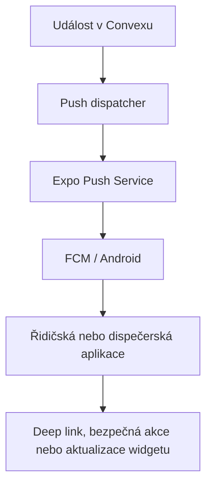

# Roadmapa: Android push, akční notifikace a dispečerský widget

## Stav dokumentu

- **Rozsah:** řidičská Android aplikace, dispečerská Android aplikace a společný Convex backend.
- **Vybrané funkce:** skutečné push notifikace, akční notifikace a widget dispečinku.
- **Stav:** schválený směr k přípravě; samotná implementace vyžaduje samostatné potvrzení.
- **Zásada:** funkce se doplňují k současným nativním aplikacím. Nenahrazují jejich obrazovky, mapu, GPS, POD ani gamifikaci.

## Cílový výsledek

1. Řidič i dispečer obdrží důležitou událost i tehdy, když je aplikace na pozadí nebo její proces neběží.
2. Klepnutí na notifikaci otevře správnou aplikaci přímo na konkrétní zakázce, chatu nebo mapě.
3. Vybrané bezpečné akce budou dostupné přímo v notifikaci.
4. Dispečer může na ploše Androidu používat widget se stavem provozu a časem poslední aktualizace.
5. Na zamčené obrazovce ani ve widgetu se nezobrazí citlivé osobní údaje zákazníků.

## Doporučená architektura

Pro první verzi použít **Expo Push Service nad FCM v1**. Současné aplikace už používají `expo-notifications` a mají vlastní EAS project ID, takže jde o nejmenší bezpečný zásah. Přímé napojení backendu na FCM lze doplnit později, pokud bude potřeba jemnější řízení doručení.

Současný backendový `pushSubscriptions` ukládá webové VAPID subscription. Mobilní tokeny musí mít vlastní tabulku a vlastní odesílací cestu; webové push notifikace zůstanou funkční beze změny.



## Fáze 0 — rozhodnutí a přístupy

### Co je potřeba

- Firebase projekt; doporučeně jeden projekt Kuryr4You se dvěma Android aplikacemi:
  - `cz.kuryr4you.driver`,
  - `cz.kuryr4you.dispatcher`.
- Aktivní EAS projekty obou aplikací — jejich project ID už jsou v konfiguraci.
- FCM v1 service-account credentials nahrané do EAS, nikdy do Git repozitáře.
- Přístup k nastavení Convex environment variables.
- Alespoň dva fyzické telefony pro test řidič/dispečer; minimálně jeden Samsung s Androidem 13 nebo novějším.
- Rozhodnutí, které události jsou **kritické**, **provozní** a **chatové**.

### Doporučené kanály Androidu

| Aplikace | Kanál | Použití | Výchozí priorita |
|---|---|---|---|
| Řidič | `k4y-driver-critical` | nově přiřazená zakázka, zrušení aktivní zakázky | vysoká |
| Řidič | `k4y-driver-rides` | volné zakázky a běžné změny | standardní |
| Řidič | `k4y-driver-chat` | zprávy dispečinku | vysoká |
| Dispečer | `k4y-dispatcher-critical` | problém zakázky, dlouho chybějící GPS, termín | vysoká |
| Dispečer | `k4y-dispatcher-rides` | nová zakázka a změna stavu | standardní |
| Dispečer | `k4y-dispatcher-chat` | zprávy řidičů | vysoká |

Uživatel musí mít možnost jednotlivé kategorie vypnout v aplikaci i v systémovém nastavení Androidu.

## Fáze 1 — evidence mobilních zařízení

### Backend

Přidat tabulku například `mobilePushDevices`:

| Pole | Účel |
|---|---|
| `userId` | vlastník zařízení |
| `expoPushToken` | aktuální Expo token zařízení |
| `platform` | pro první verzi `android` |
| `appKind` | `driver` nebo `dispatcher` |
| `deviceId` | stabilní interní identifikátor instalace, ne reklamní ID |
| `appVersion` | diagnostika neaktuálních klientů |
| `enabled` | globální zapnutí mobilních push zpráv |
| `lastSeenAt` | poslední potvrzení aktivního zařízení |
| `createdAt` | audit vytvoření |

Doporučené indexy:

- podle uživatele,
- unikátní podle Expo tokenu,
- podle kombinace `userId + appKind + deviceId`.

### Mobilní aplikace

Po přihlášení:

1. vysvětlit důvod oznámení a požádat o Android permission;
2. získat Expo push token s příslušným EAS project ID;
3. uložit token na backend společně s typem aplikace a verzí;
4. obnovit registraci při změně tokenu nebo přeinstalaci;
5. při odhlášení deaktivovat pouze danou instalaci a vymazat lokální citlivý stav.

Token se nesmí vázat pouze na e-mail ani ukládat do logů v plném znění.

## Fáze 2 — jednotná backendová push služba

Vytvořit samostatnou interní službu například `mobilePushActions.ts`, která:

- přijme `userId`, typ události, nadpis, stručný text a bezpečný datový payload;
- vybere všechna aktivní zařízení uživatele;
- odešle zprávu přes Expo Push API;
- uloží identifikátory odeslaných zpráv;
- zpracuje Expo push receipts;
- deaktivuje tokeny s chybou `DeviceNotRegistered`;
- používá omezené opakování s exponential backoff;
- zabrání duplicitnímu odeslání stejné události.

Do payloadu posílat pouze identifikátory a navigační informace, například:

```json
{
  "eventId": "ride-assigned:<rideId>:<version>",
  "eventType": "ride_assigned",
  "rideId": "<rideId>",
  "screen": "ride-detail",
  "actionVersion": 1
}
```

Celou adresu, telefon nebo obsah interní poznámky neposílat jako data pro widget či zamčenou obrazovku. Aplikace detail bezpečně načte až po ověření přihlášení.

### Napojované události první verze

**Řidič:**

- přiřazení zakázky,
- nová volná zakázka podle současných preferencí a cooldownu,
- zrušení nebo zásadní změna aktivní zakázky,
- nová chatová zpráva,
- nový odznak nebo level pouze v běžném, ne kritickém kanálu.

**Dispečer:**

- nová zakázka čekající na schválení,
- změna stavu aktivní zakázky,
- zpráva řidiče,
- provozní problém nebo incident,
- řidič s aktivní zakázkou bez čerstvé GPS,
- překročený termín vyzvednutí nebo doručení.

Kontrola staré GPS a termínů má běžet v backendové naplánované úloze. Mobil nesmí každé dvě minuty procházet všechna data jen kvůli vytvoření notifikace.

## Fáze 3 — deep linky a akční notifikace

### Navigace po klepnutí

Použít existující schémata:

- `kuryr4you://...` pro řidiče,
- `kuryr4you-dispatcher://...` pro dispečera.

Přidat centrální `NotificationRouter`, který funguje při:

- otevřené aplikaci,
- aplikaci na pozadí,
- úplně ukončené aplikaci,
- čekání na obnovení přihlášení.

Při cold startu se požadovaná navigace uloží jako čekající a provede se teprve po ověření uživatele a jeho oprávnění k zakázce. Neexistující nebo nepřístupná zakázka skončí bezpečně na seznamu s vysvětlením.

### Doporučené akce první verze

| Událost | Řidič | Dispečer |
|---|---|---|
| Nová zakázka | `Zobrazit`, `Navigovat` | `Otevřít detail`, `Zobrazit řidiče` |
| Chat | `Odpovědět`, `Otevřít chat` | `Odpovědět`, `Otevřít chat` |
| Zpoždění / problém | `Nahlásit zdržení` | `Potvrdit převzetí`, `Zavolat řidiči` |
| Stará GPS | — | `Otevřít mapu`, `Zavolat řidiči` |

První verze nesmí přímo z notifikace:

- dokončit doručení,
- změnit stav zakázky bez otevření aplikace,
- přiřadit jiného řidiče,
- udělit XP,
- potvrdit operaci s finančním dopadem.

Tyto operace zůstanou v aplikaci s existujícím potvrzením. Bezpečné mutační akce, například „Nahlásit zdržení“, musí mít `eventId`, idempotency klíč a auditní záznam, aby se dvojí klepnutí neprovedlo dvakrát.

### Lokální chování

- registrovat notification categories při startu aplikace;
- rozlišit otevření celé notifikace a konkrétní action identifier;
- po otevření označit odpovídající interní notifikaci jako přečtenou;
- odstranit současné lokální napodobování push zpráv tam, kde by vytvářelo duplicity;
- zachovat stávající trvalou GPS/status notifikaci řidiče jako oddělený kanál.

## Fáze 4 — dispečerský Android widget

Oficiální `expo-widgets` v aktuální verzi poskytuje widgety pro iOS, nikoli Android. Pro dispečerskou aplikaci proto vytvořit malý vlastní Android modul a Expo config plugin, aniž by se převáděla celá aplikace z React Native.

### Navržená struktura

- `mobile-dispatcher/modules/k4y-dispatcher-widget/`
  - Kotlin `AppWidgetProvider` nebo Jetpack Glance widget,
  - nativní úložiště snapshotu,
  - bridge funkce `updateWidget(snapshot)` a `clearWidget()`;
- `mobile-dispatcher/plugins/withDispatcherWidget.js`
  - registrace receiveru v Android manifestu,
  - generování widget metadata a resources,
  - konfigurace deep-link intentů.

Nativní soubory je vhodné generovat přes config plugin/CNG. Ruční nezdokumentované změny ve vygenerovaném adresáři `android/` by se při dalším prebuild mohly ztratit.

### Data widgetu MVP

- aktivní zakázky,
- čeká na schválení,
- zakázky po termínu,
- řidiči online,
- řidiči se starou GPS,
- čas poslední aktualizace.

Rozměry:

- **malý 2×2:** čeká na schválení + kritické události;
- **široký 4×2:** všechny uvedené metriky a čas aktualizace.

Klepnutí:

- hlavní část → dashboard,
- čekající zakázky → filtrovaný seznam,
- řidiči/GPS → živá mapa.

### Synchronizace widgetu

MVP nesmí uchovávat Convex přihlašovací token přímo ve widgetu. React Native aplikace při každé změně dashboardových dat zapíše sanitizovaný snapshot do nativního `SharedPreferences` nebo `DataStore` a vyžádá překreslení widgetu.

Widget vždy zobrazí „Aktualizováno HH:mm“. Pokud je snapshot starší než určený limit, zobrazí stav jako zastaralý místo zdánlivě živých čísel. Po odhlášení se snapshot smaže.

Pozdější rozšíření může aktualizovat snapshot pomocí tiché push události nebo omezené background task. To se má přidat až po změření spolehlivosti a spotřeby; widget nebude spouštět agresivní periodické dotazování backendu.

## Fáze 5 — testování a rollout

### Automatické kontroly

- TypeScript typecheck obou aplikací a Convexu.
- Test serializace a validace push payloadů.
- Test idempotence akcí.
- Test oprávnění: uživatel nesmí deep linkem otevřít cizí zakázku.
- Test vyřazení neplatného tokenu.
- Android build APK obou aplikací a produkční AAB řidiče.
- Test config pluginu opakovaným čistým prebuildem.

### Ruční testovací matice

Každou zásadní událost ověřit při:

1. aplikaci otevřené;
2. aplikaci na pozadí;
3. aplikaci odstraněné z posledních aplikací;
4. restartovaném telefonu;
5. zamčené obrazovce;
6. dočasně vypnutém internetu;
7. zakázaných notifikacích;
8. dvou zařízeních přihlášených ke stejnému účtu;
9. odhlášení a přihlášení jiného uživatele;
10. úsporném režimu Samsungu.

Widget navíc ověřit po změně rozměru, restartu launcheru, odhlášení a aktualizaci aplikace.

### Postup vydání

1. Interní APK pro řidiče a dispečera.
2. Test s jedním řidičem a jedním dispečerem.
3. Push pouze pro chat a přiřazení zakázky.
4. Po ověření zapnout provozní a kritická pravidla.
5. Widget uvolnit nejdřív v dispečerském GitHub APK.
6. Řidičskou verzi vydat přes interní test Google Play a následně produkční rollout.

Každou novou kategorii události zapínat přes backendový feature flag, aby ji bylo možné vypnout bez nového APK/AAB.

## Akceptační kritéria

- Push dorazí na fyzické zařízení i při ukončené aplikaci.
- Jedna backendová událost nevytvoří duplicitní mobilní notifikace na stejném zařízení.
- Klepnutí otevře správnou zakázku, chat nebo mapu po všech stavech spuštění aplikace.
- Citlivá mutace se neprovede bez autorizace a požadovaného potvrzení.
- Neplatné a odhlášené tokeny se přestanou používat.
- Webové VAPID push notifikace zůstanou funkční.
- Widget nikdy nezobrazuje údaje předchozího přihlášeného dispečera.
- Widget jasně ukazuje čas poslední aktualizace a zastaralý stav.
- Na zamčené obrazovce a ve widgetu nejsou adresy, telefony ani interní poznámky.

## Odhad náročnosti

Orientačně pro jednoho vývojáře se znalostí projektu:

| Část | Odhad |
|---|---:|
| Firebase/EAS konfigurace a evidence zařízení | 1–2 pracovní dny |
| Backendové odesílání, receipts a napojení událostí | 2–4 pracovní dny |
| Příjem, deep linky a akční notifikace v obou aplikacích | 3–5 pracovních dnů |
| Nativní Android widget + Expo config plugin | 3–5 pracovních dnů |
| Testování, opravy a interní rollout | 2–4 pracovní dny |

Celkem přibližně **11–20 pracovních dnů**, podle rozsahu kritických pravidel a chování widgetu na různých Samsung zařízeních. Odhad nezahrnuje čekání na Google Play kontrolu.

## Dokumentace

- [Expo: Push notifications setup](https://docs.expo.dev/push-notifications/push-notifications-setup/)
- [Expo: Sending notifications](https://docs.expo.dev/push-notifications/sending-notifications/)
- [Expo Notifications: interactive categories](https://docs.expo.dev/versions/latest/sdk/notifications/)
- [Expo: receiving notifications](https://docs.expo.dev/push-notifications/receiving-notifications/)
- [Firebase Cloud Messaging for Android](https://firebase.google.com/docs/cloud-messaging/android/receive-messages)
- [Expo config plugins](https://docs.expo.dev/config-plugins/introduction/)
- [Android app widgets](https://developer.android.com/develop/ui/views/appwidgets)

